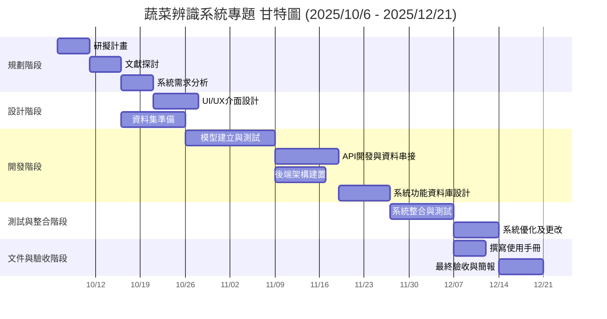

# 專題簡介(第九組)

## 組員
林杉泰、顏玉靜、廖村浩、湯又蓁

## 方向
資源回收AI辨識

## 動機
看到學校回收桶有很多人分類都亂丟，造成清潔人員的困擾

## 受眾
- 前端網頁：不擅長分類的學生  
- 後端數據分析：管理者、決策人員  

## 技術
- YOLO  
- Python  
- OpenCV  

## 目標
期望改善回收亂分的問題，減少清潔人員的工作量

## 甘特圖




```mermaid
graph TD
    %% === 專題 PERT / CPM 圖 ===
    %% 日期範圍：2025/10/6 - 2025/12/21

    A1[1. 研擬計畫<br/>(D)] --> A2[2. 文獻探討<br/>(A,D)]
    A2 --> A3[3. 系統需求分析<br/>(B,D)]
    A3 --> B1[4. UI/UX 介面設計<br/>(C)]
    A2 --> B2[5. 資料集準備<br/>(A)]
    B2 --> C1[6. 模型建立與測試<br/>(A)]
    A3 --> C2[7. API 開發與資料串接<br/>(B)]
    A3 --> C3[8. 後端架構建置<br/>(B)]
    C1 --> C2
    C1 --> C3
    C2 --> C4[9. 系統功能與資料庫設計<br/>(B,C)]
    C3 --> C4
    C4 --> D1[10. 系統整合與測試<br/>(全體)]
    D1 --> D2[11. 系統優化及更改<br/>(A,B,C)]
    D1 --> E1[12. 撰寫使用手冊<br/>(D)]
    D2 --> E2[13. 最終驗收與簡報<br/>(全體)]
    E1 --> E2

    %% 標示起點與終點
    start((Start)) --> A1
    E2 --> end((End))

```
