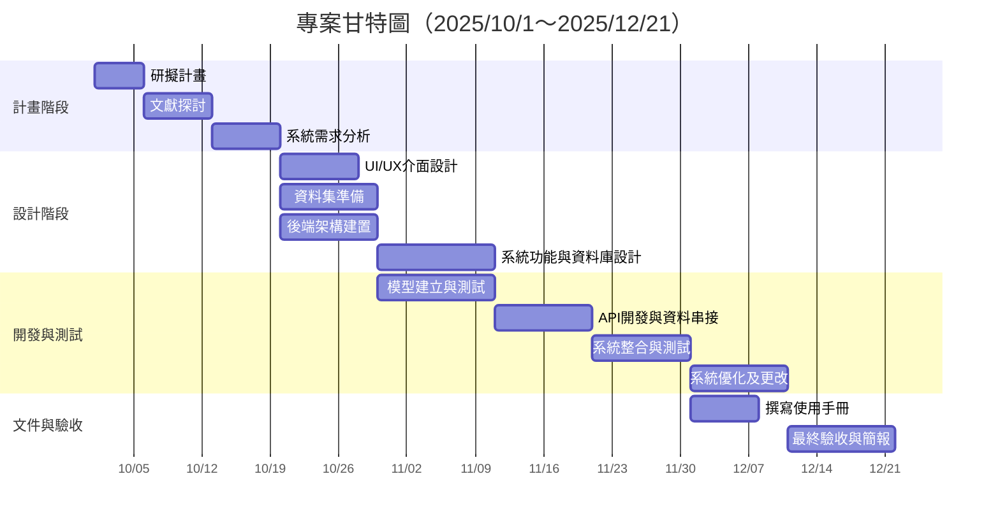
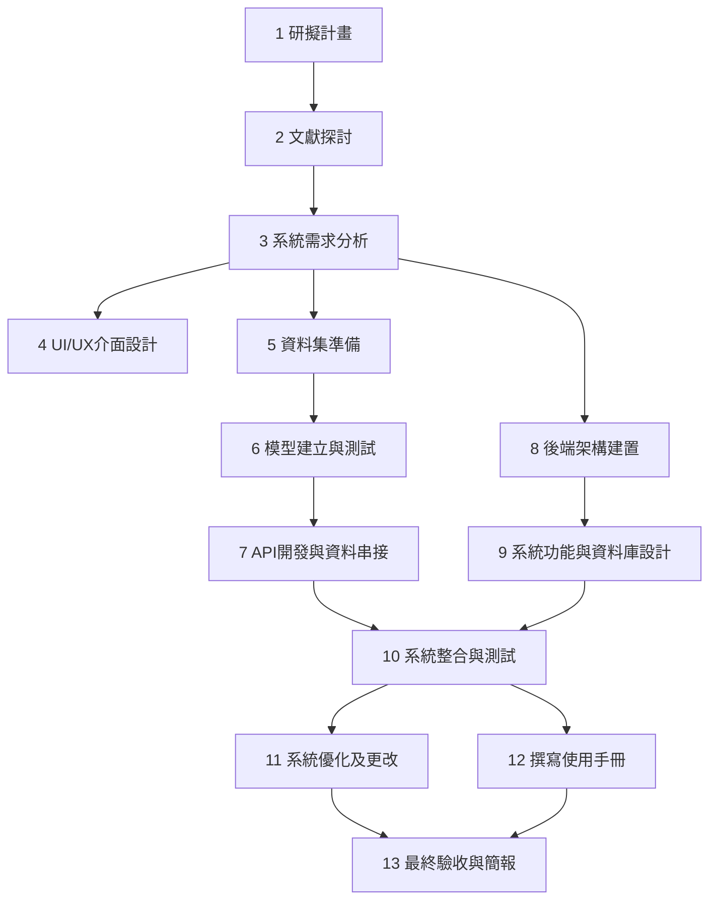

# 專題簡介(第九組)

## 組員
林杉泰、顏玉靜、廖村浩、湯又蓁

## 方向
資源回收AI辨識

## 動機
看到學校回收桶有很多人分類都亂丟，造成清潔人員的困擾

## 受眾
- 前端網頁：不擅長分類的學生  
- 後端數據分析：管理者、決策人員  

## 技術
- YOLO  
- Python  
- OpenCV  

## 目標
期望改善回收亂分的問題，減少清潔人員的工作量

## 甘特圖

