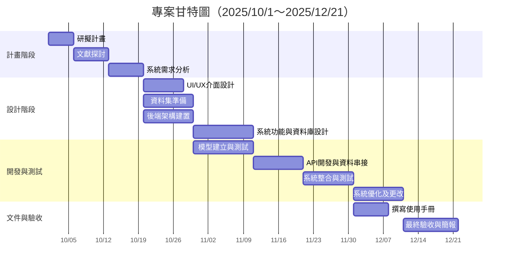
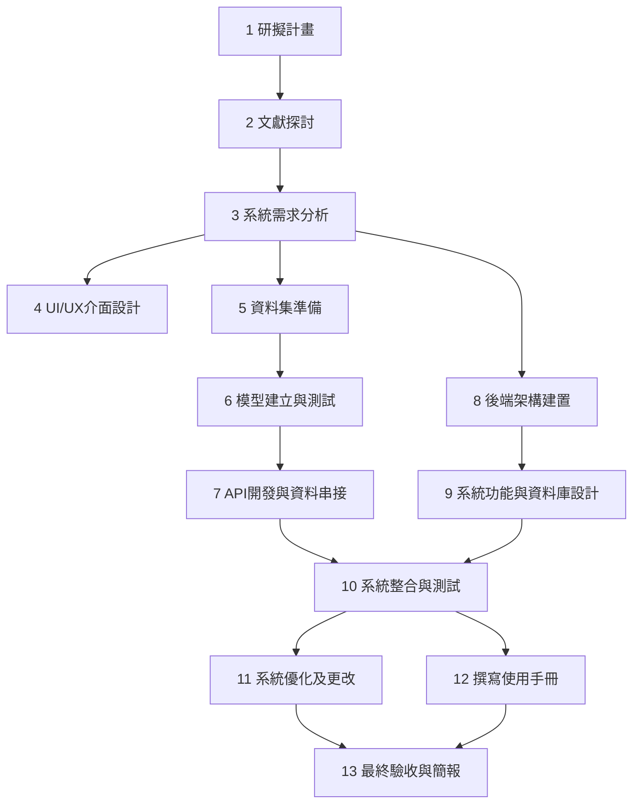

# 第九組-專題簡介-蔬菜辨識系統

## 組員
林杉泰、顏玉靜、廖村浩、湯又蓁

## 專題方向
蔬菜辨識AI網頁

## 動機發想
到菜市場買菜時，常常會遇到以下問題：
- 認不出這是什麼菜
- 不清楚菜的市價
- 無法判斷蔬菜新鮮度
容易因為不熟悉價格怕被坑、怕買錯菜，而選擇到超市購買價格較高但更有保障的蔬菜。

## 目標受眾
- 五穀不分的年輕人:缺乏生鮮採購經驗，但具有基礎數位能力的年輕消費者

## 技術
- Roboflow (用於資料標註、資料增強、版本控制和快速匯出)
- PyTorch 或 TensorFlow (用於編寫和訓練模型的核心程式碼)
- Python (機器學習領域的標準語言)
- FastAPI 或 Flask (API 框架，讓前端App可以發送圖片並接收辨識結果)
- React 或 Vue.js (網頁開發框架)
- Tailwind CSS (樣式與設計)

## 專題目標
- 提供即時蔬菜種類及市價資訊，降低年輕人逛傳統市場的心理門檻
- 提升傳統市場客流量，促進存續
- 可延伸功能：辨識蔬菜新鮮度、歷史查詢紀錄、食用價值和相關食譜等

## 實作方式
- 使用者透過手機掃描蔬菜
- 系統辨識蔬菜種類與顯示目前市價
- 介面可呈現網頁或 App，操作簡單、直覺

## 方案優勢
- 蔬菜圖片資料較容易取得，方便 AI 訓練
- 面向年輕人，容易招募測試者
- 有助於傳統市場行銷與創新服務

