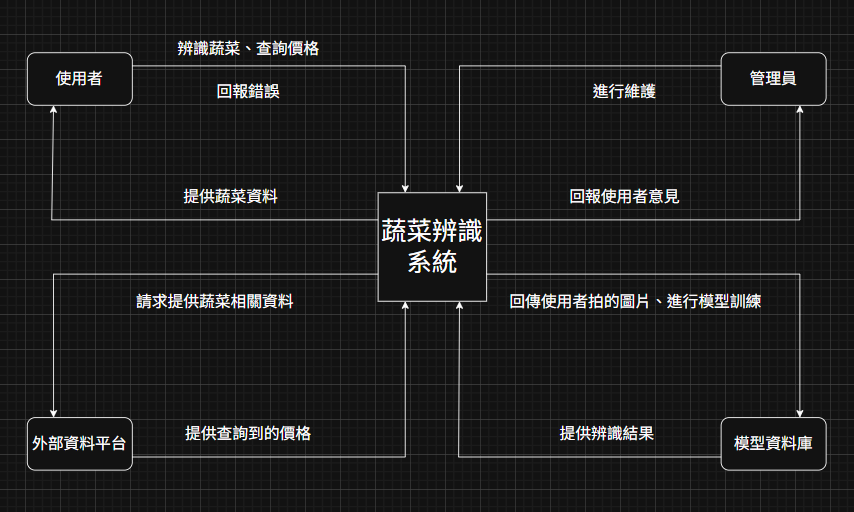
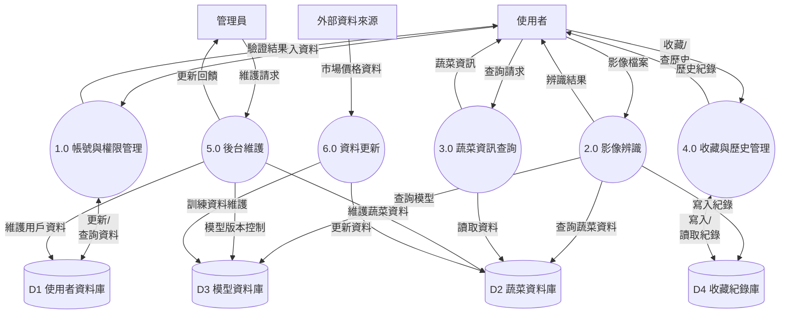

```mermaid
flowchart TD
  %% 外部實體
  U[使用者]
  M[管理員]
  API[外部資料來源]

  %% 系統處理（圓形）
  P1((1.0 帳號與權限管理))
  P2((2.0 影像辨識))
  P3((3.0 蔬菜資訊查詢))
  P4((4.0 收藏與歷史管理))
  P5((5.0 後台維護))
  P6((6.0 資料更新))

  %% 資料儲存（圓柱體）
  D1[(D1 使用者資料庫)]
  D2[(D2 蔬菜資料庫)]
  D3[(D3 模型資料庫)]
  D4[(D4 收藏紀錄庫)]

  %% 資料流

  %% 1. 使用者 - 帳號/權限 (P1) - D1
  U -- 登入資料 --> P1
  P1 -- 驗證結果 --> U
  P1 <-->|更新/<br/>查詢資料| D1

  %% 2. 使用者 - 影像辨識 (P2)
  U -- 影像檔案 --> P2
  P2 -- 辨識結果 --> U
  P2 -- 查詢模型 --> D3
  P2 -- 查詢蔬菜資料 --> D2
  P2 -- 寫入紀錄 --> D4
 
  %% 3. 使用者 - 資訊查詢 (P3)
  U -- 查詢請求 --> P3
  P3 -- 蔬菜資訊 --> U
  P3 -- 讀取資料 --> D2

  %% 4. 使用者 - 收藏/歷史 (P4)
  U -- 收藏/<br/>查歷史 --> P4
  P4 -- 歷史紀錄 --> U
  P4 <-->|寫入/<br/>讀取紀錄| D4
 
  %% 5. 管理員 (M) - 後台維護 (P5) - 資料庫
  M -- 維護請求 --> P5
  P5 -- 更新回饋 --> M
  P5 -- 維護用戶資料 --> D1
  P5 -- 維護蔬菜資料 --> D2
  P5 -- 模型版本控制 --> D3

  %% 6. 外部資料 (API) - 資料更新 (P6)
  API -- 市場價格資料 --> P6
  P6 -- 更新資料 --> D2
  P6 -- 訓練資料維護 --> D3
```
