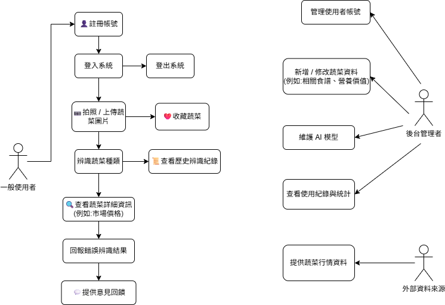

✅ 功能性需求（Functional Requirements）

蔬菜影像辨識功能

使用者透過手機鏡頭拍攝蔬菜，系統能即時辨識蔬菜種類。

即時市場價格顯示

系統根據辨識結果，顯示該蔬菜在當地傳統市場的參考價格，協助使用者判斷合理價格。

進階資訊查詢功能（可擴充）

包含蔬菜新鮮度判斷、歷史價格查詢、個人購買記錄等，提升互動性與實用性。

✅ 非功能性需求（Non-Functional Requirements）

使用者介面友善性

系統需具備簡潔直覺的操作介面，讓不熟悉市場的年輕人也能輕鬆使用。

系統反應速度與穩定性

辨識與價格顯示需在短時間內完成，確保使用者在購買過程中能即時獲得資訊。

資料安全與隱私保護

若系統記錄使用者購買行為或偏好，需妥善保護個人資料，符合相關法規。

