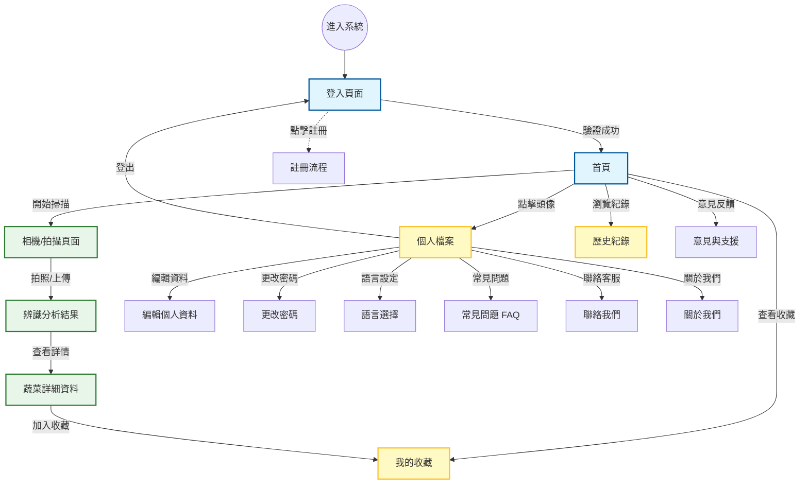

```mermaid
graph TD
    %% 定義節點樣式
    classDef main fill:#e1f5fe,stroke:#01579b,stroke-width:2px;
    classDef action fill:#e8f5e9,stroke:#2e7d32,stroke-width:2px;
    classDef sub fill:#fff9c4,stroke:#fbc02d,stroke-width:2px;

    %% 流程開始
    Start((進入系統)) --> LoginView[登入頁面]
    
    %% 登入區塊
    LoginView -->|驗證成功| HomeView[首頁]
    LoginView -.->|點擊註冊| SignUp[註冊流程]

    %% 首頁核心功能
    HomeView -->|開始掃描| CameraView[相機/拍攝頁面]
    HomeView -->|點擊頭像| ProfileView[個人檔案]
    HomeView -->|瀏覽紀錄| HistoryView[歷史紀錄]
    HomeView -->|查看收藏| FavoritesView[我的收藏]
    HomeView -->|意見反饋| FeedbackView[意見與支援]

    %% 辨識流程
    CameraView -->|拍照/上傳| IdentifyView[辨識分析結果]
    IdentifyView -->|查看詳情| DetailsView[蔬菜詳細資料]
    DetailsView -->|加入收藏| FavoritesView

    %% 個人檔案與設定
    ProfileView -->|編輯資料| EditProfile[編輯個人資料]
    ProfileView -->|更改密碼| ChangePwd[更改密碼]
    ProfileView -->|語言設定| Language[語言選擇]
    ProfileView -->|常見問題| FAQ[常見問題 FAQ]
    ProfileView -->|聯絡客服| Contact[聯絡我們]
    ProfileView -->|關於我們| About[關於我們]
    
    %% 登出
    ProfileView -->|登出| LoginView

    %% 樣式套用
    class HomeView,LoginView main;
    class CameraView,IdentifyView,DetailsView action;
    class ProfileView,HistoryView,FavoritesView sub;
```
